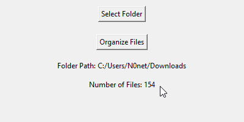

# Folder Organizer

A simple Python script with a graphical user interface (GUI) for organizing files into different folders based on their types. The script uses `tkinter` for the GUI and `shutil` for file operations.

## Features

- **Organizes Files**: Automatically moves files into categorized folders (Audio, Videos, Images, CompressedFiles, PDFs, Text Files, Install Media, Other files) based on their extensions.
- **User-Friendly Interface**: Select a folder and initiate file organization through an intuitive GUI.
- **Automatic Folder Creation**: Creates necessary folders if they don't already exist.

## Requirements

- Python 3.x
- `tkinter` (usually included with Python installation)
- `shutil` (usually included with Python installation)

## Installation

1. **Clone the Repository:**

    ```bash
    git clone https://github.com/yourusername/file-organizer.git
    ```

2. **Navigate to the Project Directory:**

    ```bash
    cd file-organizer
    ```

3. **Run the Script:**

    ```bash
    python file_organizer.py
    ```

## Usage

1. **Select Folder**: Click the "Select Folder" button to choose the folder you want to organize.

    
   

3. **Organize Files**: Click the "Organize Files" button to start the organization process. The script will move files into respective folders based on their type.

    

4. **Status Updates**: The GUI will display the selected folder path and the number of files present.

    
    
   
   


## File Types and Categories

- **Audio**: `.3ga`, `.aac`, `.ac3`, `.aif`, `.aiff`, `.alac`, `.amr`, `.ape`, `.au`, `.dss`, `.flac`, `.flv`, `.m4a`, `.m4b`, `.m4p`, `.mp3`, `.mpga`, `.ogg`, `.oga`, `.mogg`, `.opus`, `.qcp`, `.tta`, `.voc`, `.wav`, `.wma`, `.wv`
- **Video**: `.webm`, `.MTS`, `.M2TS`, `.TS`, `.mov`, `.mp4`, `.m4p`, `.m4v`, `.mxf`, `.avi`
- **Image**: `.jpg`, `.jpeg`, `.jfif`, `.pjpeg`, `.pjp`, `.png`, `.gif`, `.webp`, `.svg`, `.apng`, `.avif`
- **Text**: `.txt`, `.doc`, `.docx`, `.odt`, `.rtf`, `.tex`, `.wks`, `.wps`, `.wpd`, `.epub`, `.mobi`, `.azw`, `.html`, `.htm`, `.xhtml`, `.md`, `.csv`, `.tsv`, `.log`, `.xlsx`
- **Compressed Files**: `.gz`, `.zip`, `.rar`
- **PDFs**: `.pdf`
- **Install Media**: `.exe`
- **Other Files**: Files that do not match the above categories

## Contributing

Feel free to contribute to the project by submitting issues or pull requests. For significant changes, please open an issue first to discuss what you would like to change.

